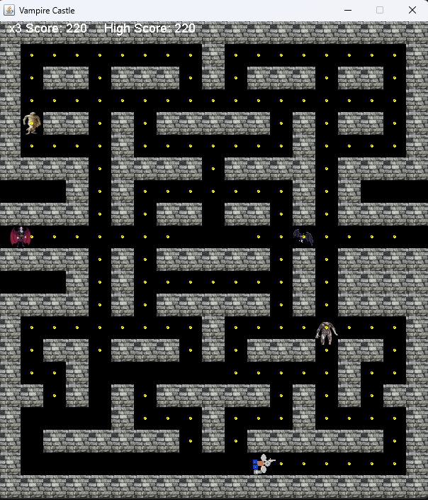

# Vampire-Castle
A Pac-Man type game that I programmed in Java from a YouTube tutorial and improved upon per the recommendations at the end of the video.

## Table of Contents
* [General info](#General-info)
* [Collaborators](#Collaborators)
* [Programming Approaches](#Programming-Approaches)
* [Technologies](#Technologies)
* [Setup](#Setup)
* [Usage](#Usage)
* [Minimum hardware requirements](#Minimum-hardware-requirements)
* [Screenshots](#Screenshots)
* [Features](#Features)
* [Room for Improvement](#Room-for-Improvement)
* [Project status](#Project-status)
* [Release date](#Release-date)
* [Sources](#Sources)
* [Contact](#Contact)
* [Disclaimer](#Disclaimer)

## General info
- Vampire Castle is a Pac-Man clone written in Java, based on a tutorial that I watched on YouTube.
- Since Pac-Man and the associated multi-colored ghosts are a little cliché, I changed the sprites to be a 32 x 32 px. warrior that I created in Paint, and the rest of the images are royalty-free images from the Web.
- It currently has three levels with the capability to add more.
- The code for writing the high score to a file, including frame.addWindowListener (commented out since it doesn't write the high score upon file close), and the loadHighScore() and saveHighScore were borrowed largely from a Google AI search summary when I searched how to do this. I don't like using AI, and I want to be original. But since I'm still learning, and to gain knowledge of advanced functions and concepts to utilize, I incorporated a little bit of suggested code into this project. 

## Collaborators
Jason Ash, Computer Science Major

## Programming Approaches
- Most of the program follows Kenny Yip's tutorial, with changes noted below and throughout this document.
- The "VampireCastle.java" file creates a JFrame with its properties and an instance of the Warrior class called warrior that inherits from JPanel and implements ActionListener and KeyListener.
- I created a variable numTimes that is used to help make the movement of the enemies more random and not so spastic when trying to randomize their movement.
- The opponents' movements are only randomized and updated every three times that the move() function is called, or else they are really twitchy in their movement if it is randomized every time.
- I added a mechanism to keep track of the high score while playing. A version written last night wrote the high score to a file named highscore.txt, but somehow, the edits I made since then broke this functionality, and I haven't been able to restore it despite my best efforts.
- Instead of having blueGhost, pinkGhost, etc. I have images for a bat, vampire, mummy, and zombie.
- I also came up with a mechanism to pause the game by pressing the 'p' key.
- I figured out on my own how to include new levels by making an array of string tile maps and referencing this in the loadMap() function.
- I changed the lives, score, high score, and game over display to white for improved contrast against the image that I chose for the walls.
- Kenny Yip didn't mention how the collision detection works on his video (in fact, he skipped the explanation for time constraints), so I followed his suggestion of just writing it as displayed in his tutorial.
- When adding a random level, you must huamually type in v, m, b, z, and W for the four opponents and the warrior sprite, respectively, or else it will result in a run-time error when you try to run the game.

## Technologies
- I programmed Warrior.java, VampireCastle.java, and AsciiMapGenerator.java in Notepad on Windows 11.
- I created the warrior and coin sprites from scratch using Paint.
- The GIMP was used to shrink the free-to-use images to 32 x 32 pixels, which is the tile size of the board in this game.
- I compile using the javac commands in the Command Prompt, and ran the program by typing java "VampireCastle" without the quotes.

## Setup
1. Download and install the JDK or Java Runtime from Oracle and configure your computer to use them (these tasks are beyond the scope of this ReadMe document).
2. Download all of the files into a folder of your choice.
3. Open a Command Prompt in that directory or change directories to the folder containing the game files.
4. Type javac VampireCastle.java followed by javac Warrior.java.
5. Type java VampireCastle to run and play the game.

## Usage
* The monsters start moving as soon as the game is launched.
* Press the up, down, left, and right arrow keys on your keyboard to move in that respective direction.
* Movement will automatically continue in that direction until you change directions or collide with a wall.
* Press the 'p' key to pause.
* Making contact with an enemy (no matter how brief) will result in one life being deducted.
* Once the number of lives reaches zero, the game over message displays, the score is reset to zero, and you restart on level 1.
* To restart the game after game over, press any key on your keyboard.

## Minimum hardware requirements
Although I developed this on a fairly recent Windows 11 PC, this program should run comfortably on any working computer with sufficient processing power, RAM, a monitor manufactured within the past 15-20 years, and an Internet connection to download the game source files.

## Screenshots

## Features
- Levels two and three were created on a randomizer program, AsciiMapGenerator.java, that I obtained from a Google AI search summary and edited to meet my needs in creating new levels.
- I edited the random maps slightly humanually since every coin must be reachable to fulfill the level completion condition that all the coins be collected.
- An extra life is granted if the player picks up 200 coins (every 2000 points since the coins are worth 10 points each).

## Room for Improvement
- The play control, as shown in the video, is really sticky, and it is difficult to change directions. However, I don't yet know enough how to improve this.
- There are not yet any items to make the monsters vulnerable so that the warrior can defeat them (similar to a power pellet in Pac-Man that makes the ghosts scared and vulnerable to being eliminated from the board).
- Currently, the functionality of writing the high score to a file upon game over or closing the game window is broken.
- Bonus items for extra score, such as the cherry in Pac-Man, are not yet programmed.
- The game uses semi-random maps and not programmer-designed maps. It also does not have a built-in random or procedurally-generated map feature, yet.
- Although it only has 3 levels, adding additional pseudorandom-generated levels by copying and pasting the output from the ASCII random map utility is trivial if desired.

## Project Status
Completed per the YouTube tutorial with the features mentioned above added and released to GitHub as-is.

## Release date
09 May, 2025

## Sources
- The Pac-Man tutorial that this game is based on was viewed on the Kenny Yip Coding YouTube Channel at https://www.youtube.com/watch?v=lB_J-VNMVpE&t=17s 
- The following graphics used in this game and uploaded to this repository are derived from the following sources:
* bat.png derived from https://www.sprite-ai.art/gallery/vampire-bat-with-dark-grey-wings-fdc1
* Dracula2.png derived from https://www.sprite-ai.art/gallery/dracula-the-vampire-13b3
* zombie.png sourced and derived from pixabay.com from https://picryl.com/media/zombie-man-horror-people-f1f77e (Creative Commons CC0 1.0 Universal Public Domain)
* mummy2.png derived from https://www.rawpixel.com/image/16090501/png-mummy-art-illustration-mummy (Free for personal and business use)
* wall.png derived from https://pxhere.com/en/photo/546524 (CC0 Public Domain Free for personal and commercial use)

## Contact
Jason Ash - wizardofki@gmail.com

## Disclaimer
This program is released under the GNU Public License 3.0. This game software and source code are expressly provided "AS IS." I (Jason Ash) MAKE NO WARRANTY OF ANY KIND, EXPRESS, IMPLIED, IN FACT, OR ARISING BY OPERATION OF LAW, INCLUDING, WITHOUT LIMITATION, THE IMPLIED WARRANTY OF MERCHANTABILITY, FITNESS FOR A PARTICULAR PURPOSE, NON-INFRINGEMENT, AND DATA ACCURACY. I NEITHER REPRESENT NOR WARRANT THAT THE OPERATION OF THE SOFTWARE WILL BE UNINTERRUPTED OR ERROR-FREE, OR THAT ANY DEFECTS WILL BE CORRECTED. I DO NOT WARRANT OR MAKE ANY REPRESENTATIONS REGARDING THE USE OF THE SOFTWARE OR THE RESULTS THEREOF, INCLUDING BUT NOT LIMITED TO THE CORRECTNESS, ACCURACY, RELIABILITY, OR USEFULNESS OF THE SOFTWARE.

You (the person downloading, copying, compiling, and running the programs in this repository) are solely responsible for determining the appropriateness of using and distributing the software, and you assume all risks associated with its use, including but not limited to the risks and costs of program errors, compliance with applicable laws, damage to or loss of data, programs, or equipment, and the unavailability or interruption of operation. This software is not intended to be used in any situation where a failure could cause risk of injury or damage to property. I assume no responsibility whatsoever regarding the downloading, use, compiling, and running of this game program and its associated ASCII random map generator utility. I will not be responsible for any incidental or consequential damages arising from its use.
